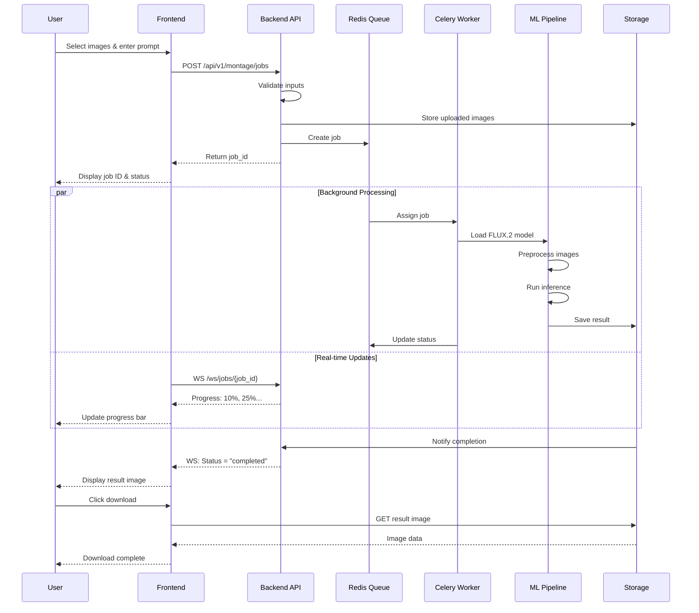

# SDD-003: VisionLab Features Catalog

## Document Information
| Field | Value |
|-------|-------|
| **Document ID** | SDD-003-FEATURES |
| **Version** | 1.0.0 |
| **Status** | Draft |
| **Last Updated** | 2025-04-21 |
| **Author** | VisionLab Team |

---

## 1. Feature Matrix

### 1.1 Feature Overview

| ID | Feature Name | Status | Priority | Complexity | Phase |
|----|--------------|--------|----------|------------|-------|
| F001 | Image Montage Generation | **MVP** | Must | Medium | 1 |
| F002 | Image Segmentation (SAM) | Planned | Should | Medium | 2 |
| F003 | Object Detection (YOLO) | Planned | Should | Medium | 2 |
| F004 | Neural Style Transfer | Planned | Could | Medium | 3 |
| F005 | Video Processing | Proposed | Could | High | 3 |
| F006 | Real-time Inference | Proposed | Won't | High | 4 |

### 1.2 Feature Dependencies

```
┌─────────────────────────────────────────────────────────────────────────┐
│                       FEATURE DEPENDENCIES                               │
├─────────────────────────────────────────────────────────────────────────┤
│                                                                          │
│  Core Infrastructure                                                      │
│       │                                                                  │
│       ├────────────────┬────────────────┬───────────────┐               │
│       ▼                ▼                ▼               ▼               │
│  ┌─────────┐     ┌─────────┐      ┌─────────┐     ┌─────────┐          │
│  │  F001   │     │  F002   │      │  F003   │     │  F004   │          │
│  │ Montage │     │   SAM   │      │  YOLO   │     │  Style  │          │
│  └─────────┘     └─────────┘      └─────────┘     └─────────┘          │
│       │                │                │               │               │
│       │                └────────────────┘               │               │
│       │                         │                       │               │
│       │                         ▼                       │               │
│       │                   ┌─────────┐                   │               │
│       │                   │  F005   │                   │               │
│       │                   │ Video   │◄──────────────────┘               │
│       │                   └─────────┘                                   │
│       │                         │                                       │
│       │                         ▼                                       │
│       │                   ┌─────────┐                                   │
│       └──────────────────►│  F006   │                                   │
│                           │ Realtime│                                   │
│                           └─────────┘                                   │
│                                                                          │
└─────────────────────────────────────────────────────────────────────────┘
```

---

## 2. Feature F001: Image Montage Generation

### 2.1 Feature Description

Image Montage Generation combines multiple input images (1-10) with a text prompt to generate a coherent, composed output image using the FLUX.2-klein-4B multimodal model.

### 2.2 User Stories

| ID | User Story | Acceptance Criteria | Priority |
|----|------------|---------------------|----------|
| US-001 | As a user, I want to upload multiple images so that I can use them as visual references | - Support 1-10 images<br>- Max 10MB per image<br>- Accept JPG, PNG, WebP | Must |
| US-002 | As a user, I want to write a text prompt so that I can describe the desired output | - Min 10, max 500 chars<br>- Support natural language<br>- Real-time char count | Must |
| US-003 | As a user, I want to see progress updates so that I know the system is working | - Progress bar during processing<br>- Status messages<br>- ETA estimation | Must |
| US-004 | As a user, I want to download the generated image so that I can use it elsewhere | - Download as PNG<br>- High quality (1024x1024) | Must |
| US-005 | As a user, I want to see my uploaded images so that I can verify what was sent | - Thumbnail preview<br>- Ability to remove/reorder | Should |
| US-006 | As a user, I want to save my prompt history so that I can reuse good prompts | - Store last 10 prompts locally | Could |

### 2.3 Acceptance Criteria

#### Functional Requirements

| ID | Requirement | Test Method |
|----|-------------|-------------|
| FR-001 | System accepts 1-10 images via drag-and-drop or file picker | Integration test |
| FR-002 | System validates image format (JPG, PNG, WebP) and size (<10MB) | Unit test |
| FR-003 | System processes prompt text (10-500 characters) | Unit test |
| FR-004 | System queues job and returns job ID within 2 seconds | Load test |
| FR-005 | System provides real-time progress via WebSocket | Integration test |
| FR-006 | System generates 1024x1024 output image | Visual regression |
| FR-007 | System stores result for 7 days minimum | Integration test |
| FR-008 | System allows download of generated image | E2E test |

#### Non-Functional Requirements

| ID | Requirement | Target |
|----|-------------|--------|
| NFR-001 | Image upload time | < 5 seconds for 10 images |
| NFR-002 | Generation latency (p50) | < 30 seconds on GPU |
| NFR-003 | Generation latency (p95) | < 60 seconds on GPU |
| NFR-004 | System availability | 99.5% uptime |
| NFR-005 | Concurrent job support | 10 simultaneous jobs |

### 2.4 Technical Requirements

#### 2.4.1 Model Configuration

```yaml
model:
  name: "black-forest-labs/FLUX.2-klein-4B"
  type: "diffusion"
  parameters:
    guidance_scale: 3.5
    num_inference_steps: 28
    height: 1024
    width: 1024
  
  optimization:
    torch_dtype: "float16"
    enable_cpu_offload: true
    use_safetensors: true
```

#### 2.4.2 Input Processing Pipeline

| Step | Description | Output |
|------|-------------|--------|
| 1. Validation | Check file type, size, dimensions | Validated files |
| 2. Preprocessing | Resize to 512x512, normalize | Tensor batch |
| 3. Encoding | Convert to model-compatible format | Embeddings |
| 4. Generation | Run inference with FLUX.2-klein | Raw output |
| 5. Postprocessing | Decode, format, compress | Final image |

### 2.5 Workflow Diagram



### 2.6 Input/Output Specifications

#### 2.6.1 Input Schema

```typescript
interface MontageJobRequest {
  /** Text prompt describing desired output */
  prompt: string;              // Required, 10-500 chars
  
  /** Array of image files (multipart/form-data) */
  images: File[];              // Required, 1-10 files
  
  /** Optional generation parameters */
  parameters?: {
    guidance_scale?: number;   // Default: 3.5, Range: 1.0-20.0
    num_steps?: number;        // Default: 28, Range: 20-50
    seed?: number;             // Optional, for reproducibility
    output_format?: 'png' | 'jpg';  // Default: 'png'
  };
}
```

#### 2.6.2 Output Schema

```typescript
interface MontageJobResponse {
  job_id: string;              // UUID v4
  status: 'queued' | 'processing' | 'completed' | 'failed';
  created_at: string;          // ISO 8601 timestamp
  estimated_completion?: string;  // ISO 8601, optional
  result?: {
    image_url: string;         // Signed URL, valid 24h
    dimensions: { width: number; height: number };
    file_size: number;         // Bytes
    format: 'png' | 'jpg';
    seed_used: number;
  };
  error?: {
    code: string;
    message: string;
    details?: Record<string, any>;
  };
}
```

### 2.7 Error Scenarios

| Code | Scenario | User Message | Recovery |
|------|----------|--------------|----------|
| E001 | Invalid image format | "Please upload JPG, PNG, or WebP images" | Re-upload |
| E002 | Image too large (>10MB) | "Image exceeds 10MB limit" | Compress/retry |
| E003 | Too many images (>10) | "Maximum 10 images allowed" | Remove excess |
| E004 | Prompt too short (<10 chars) | "Please provide a more detailed prompt" | Expand prompt |
| E005 | Prompt too long (>500 chars) | "Prompt must be under 500 characters" | Shorten prompt |
| E006 | Generation timeout | "Generation timed out, please retry" | Retry job |
| E007 | Model error | "Image generation failed, please try again" | Retry with different settings |
| E008 | Queue full | "High demand, please try again in a few minutes" | Retry later |
| E009 | Storage error | "Failed to save result, please contact support" | Contact support |

---

## 3. Proposed Features

### 3.1 Feature F002: Image Segmentation (SAM-based)

#### Description
Segment-anything functionality using Meta's Segment Anything Model (SAM) for automatic and interactive image segmentation.

#### User Stories

| ID | User Story | Priority |
|----|------------|----------|
| US-101 | As a user, I want automatic segmentation of all objects | Must |
| US-102 | As a user, I want to click on objects to segment them | Must |
| US-103 | As a user, I want to download segmentation masks | Should |
| US-104 | As a user, I want to adjust segmentation granularity | Could |

#### Acceptance Criteria

- Support SAM (Segment Anything Model) and SAM-2
- Accept single image input
- Provide coarse/medium/fine granularity levels
- Export masks as PNG or JSON
- Processing time < 5 seconds per image

#### Technical Dependencies

| Dependency | Version | Purpose |
|------------|---------|---------|
| SAM | facebook/sam-vit-huge | Core segmentation model |
| OpenCV | 4.9+ | Image preprocessing |
| NumPy | 1.24+ | Mask manipulation |

---

### 3.2 Feature F003: Object Detection (YOLO)

#### Description
Real-time object detection using YOLOv8/v9 architecture for identifying and localizing objects in images.

#### User Stories

| ID | User Story | Priority |
|----|------------|----------|
| US-201 | As a user, I want to detect objects in an image | Must |
| US-202 | As a user, I want to see bounding boxes around objects | Must |
| US-203 | As a user, I want object labels and confidence scores | Must |
| US-204 | As a user, I want to filter by object category | Should |
| US-205 | As a user, I want to export detection results | Should |

#### Acceptance Criteria

- Support YOLOv8n/v8m/v8x model variants
- Detect 80+ COCO classes
- Minimum confidence threshold: 0.25
- Bounding box visualization on image
- JSON export with detections array
- Processing time < 3 seconds per image

#### Technical Dependencies

| Dependency | Version | Purpose |
|------------|---------|---------|
| YOLOv8 | 8.2+ | Core detection model |
| Ultralytics | latest | Model inference API |
| Pillow | 10.0+ | Image drawing |

---

### 3.3 Feature F004: Neural Style Transfer

#### Description
Transfer artistic style from one image to another using neural style transfer algorithms.

#### User Stories

| ID | User Story | Priority |
|----|------------|----------|
| US-301 | As a user, I want to select a content image | Must |
| US-302 | As a user, I want to select a style image | Must |
| US-303 | As a user, I want to control style intensity | Should |
| US-304 | As a user, I want to see style transfer presets | Could |

#### Acceptance Criteria

- Support arbitrary content and style images
- Adjustable style/content weight ratio (0.1-10.0)
- Output resolution matching content image
- Multiple algorithm options: VGG-based, Fast Neural Style
- Processing time < 30 seconds for 512x512

#### Technical Dependencies

| Dependency | Version | Purpose |
|------------|---------|---------|
| PyTorch | 2.0+ | Framework |
| Pretrained VGG | 19 layers | Feature extraction |
| Optional: AdaIN | - | Fast style transfer |

---

### 3.4 Feature F005: Video Processing

#### Description
Apply vision techniques to video files: frame extraction, video segmentation, or style transfer per frame.

#### User Stories

| ID | User Story | Priority |
|----|------------|----------|
| US-401 | As a user, I want to upload a video file | Must |
| US-402 | As a user, I want to apply segmentation to video | Should |
| US-403 | As a user, I want style transfer on video | Should |
| US-404 | As a user, I want to download processed video | Must |

#### Acceptance Criteria

- Support MP4, MOV, AVI formats
- Max file size: 100MB
- Max duration: 60 seconds
- Frame rate: maintain original or 24/30 fps
- Resolution options: 480p, 720p, 1080p
- Background processing with progress tracking

#### Technical Dependencies

| Dependency | Version | Purpose |
|------------|---------|---------|
| FFmpeg | 5.0+ | Video encoding/decoding |
| OpenCV | 4.9+ | Frame processing |
| Base dependencies | F002/F004 | Segmentation/Style per frame |

---

### 3.5 Feature F006: Real-time Inference

#### Description
camera-based real-time inference pipeline for live segmentation or detection.

#### User Stories

| ID | User Story | Priority |
|----|------------|----------|
| US-501 | As a user, I want to enable camera access | Must |
| US-502 | As a user, I want to see real-time segmentation | Should |
| US-503 | As a user, I want to switch detection models | Could |
| US-504 | As a user, I want to save snapshots | Should |

#### Acceptance Criteria

- WebRTC camera access
- 15+ FPS on modern hardware
- Latency < 100ms (excluding network)
- Support segmentation or detection mode
- Snapshot capture capability

#### Technical Dependencies

| Dependency | Version | Purpose |
|------------|---------|---------|
| WebRTC | native | Camera access |
| WebSocket | - | Frame streaming |
| Optimized inference | - | Fast model inference |
| WebGL (optional) | - | Client-side rendering |

---

## 4. Feature Prioritization Matrix (MoSCoW)

### 4.1 MoSCoW Classification

| Feature | Must Have | Should Have | Could Have | Won't Have |
|---------|-----------|-------------|------------|------------|
| **F001** Image Montage | ★ Core MVP | | | |
| **F002** SAM Segmentation | | ★ Phase 2 | | |
| **F003** YOLO Detection | | ★ Phase 2 | | |
| **F004** Style Transfer | | | ★ Phase 3 | |
| **F005** Video Processing | | | ★ Phase 3 | |
| **F006** Real-time Inference | | | | ★ Phase 4 |

### 4.2 Prioritization Rationale

#### Must Have (MVP)
- Image Montage is the core differentiator and learning objective
- Demonstrates multimodal AI integration
- Required for project validation

#### Should Have (Phase 2)
- SAM Segmentation and YOLO Detection are standard CV tasks
- High educational value
- Build upon established architectures
- Users expect these in a CV toolkit

#### Could Have (Phase 3)
- Style Transfer and Video Processing enhance value
- More complex implementation
- Less critical for core learning

#### Won't Have (Phase 4)
- Real-time inference requires significant infrastructure
- WebRTC complexity
- Can be deferred indefinitely

### 4.3 Effort vs. Value Matrix

```
     HIGH │  F002       F001         
     VAL  │  (SAM)      (Montage)    
          │  ★                       
          │              F003        
          │              (YOLO)      
          │  ★            ★          
          │                            
          │              F004         
          │              (Style)      
          │  ★                       
     LOW  │     F006      ★           
          │     (Realtime)   F005     
          │  ★           ★  (Video)   
          └───────────────────────────
            LOW         MEDIUM       HIGH
                      EFFORT
```

---

## 5. References

| Reference | Description |
|-----------|-------------|
| [FLUX.2-klein-4B](https://huggingface.co/black-forest-labs/FLUX.2-klein-4B) | Core image generation model |
| [Segment Anything](https://segment-anything.com/) | Meta AI SAM documentation |
| [YOLOv8](https://docs.ultralytics.com/) | Ultralytics YOLO documentation |
| [Neural Style Transfer](https://pytorch.org/tutorials/advanced/neural_style_tutorial.html) | PyTorch tutorial |
| [SDD-001](./SDD-001-OVERVIEW.md) | Project overview |
| [SDD-002](./SDD-002-ARCHITECTURE.md) | Architecture specification |

---

## 6. Appendix

### A. Feature Request Template

```markdown
## Feature Request: [Feature Name]

### Problem Statement
[What user need does this address?]

### Proposed Solution
[Description of feature]

### User Stories
- As a user, I want ...
- As a user, I want ...

### Acceptance Criteria
- [ ] Criterion 1
- [ ] Criterion 2

### Technical Notes
- Model requirements:
- API changes:
- UI changes:

### Priority
[ ] Must Have  [ ] Should Have  [ ] Could Have
```

### B. Feature Status Definitions

| Status | Definition |
|--------|------------|
| **MVP** | Currently being implemented, must be in v1.0 |
| **Planned** | Approved for implementation, scheduled |
| **Proposed** | Under consideration, pending approval |
| **Deprecated** | Feature to be removed in future version |
| **Archived** | Feature removed, documentation kept |

---

## 7. Change Log

| Version | Date | Author | Changes |
|---------|------|--------|---------|
| 1.0.0 | 2025-04-21 | VisionLab Team | Initial feature catalog creation |
