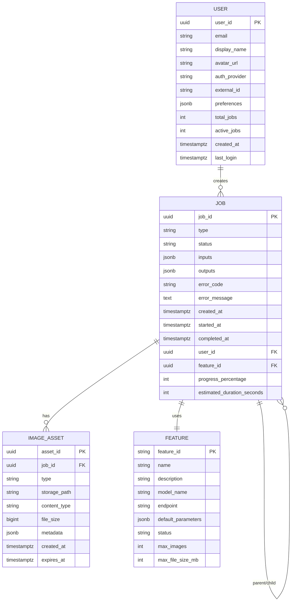

# SDD-005: VisionLab Data Model

## Document Information
| Field | Value |
|-------|-------|
| **Document ID** | SDD-005-DATA-MODEL |
| **Version** | 1.0.0 |
| **Status** | Draft |
| **Last Updated** | 2025-04-21 |
| **Author** | VisionLab Team |

---

## 1. Entity Overview

### 1.1 Entity Summary

| Entity | Purpose | Storage | Lifecycle |
|--------|---------|---------|-----------|
| **Job** | Tracks all processing jobs | PostgreSQL | 30 days retention |
| **Feature** | Feature registry and config | PostgreSQL | Permanent |
| **ImageAsset** | Uploaded and generated images | S3/MinIO + PostgreSQL metadata | 24h (input) / 7d (output) |
| **User** | User accounts and profiles | PostgreSQL | Permanent (Phase 2) |

### 1.2 Entity Relationship Diagram



### 1.3 Quick Reference: Foreign Keys

| Table | FK Column | References |
|-------|-----------|------------|
| `jobs` | `user_id` | `users.user_id` (Phase 2) |
| `jobs` | `feature_id` | `features.feature_id` |
| `image_assets` | `job_id` | `jobs.job_id` |

---

## 2. Entity Specifications

### 2.1 Job Entity

#### 2.1.1 Description

The Job entity is the core tracking mechanism for all processing tasks in VisionLab. Every user request creates a job record that tracks its lifecycle from submission to completion.

#### 2.1.2 Schema

```sql
CREATE TABLE jobs (
    -- Primary identifiers
    job_id          UUID PRIMARY KEY DEFAULT gen_random_uuid(),
    type            VARCHAR(50) NOT NULL,          -- e.g., 'montage', 'segmentation'
    status          VARCHAR(20) NOT NULL DEFAULT 'queued',
                                          -- queued, processing, completed, failed, cancelled
    
    -- External references
    user_id         UUID REFERENCES users(user_id) ON DELETE SET NULL,
    feature_id      VARCHAR(50) NOT NULL REFERENCES features(feature_id),
    
    -- Input/Output
    inputs          JSONB NOT NULL,                -- {images: [...], prompt: "..."}
    outputs         JSONB,                          -- {image_url: "...", dimensions: {...}}
    
    -- Error tracking
    error_code      VARCHAR(50),
    error_message   TEXT,
    
    -- Progress
    progress_percentage  INT DEFAULT 0 CHECK (progress_percentage BETWEEN 0 AND 100),
    current_step    VARCHAR(50),
    estimated_duration_seconds INT,
    
    — Timestamps
    created_at      TIMESTAMPTZ DEFAULT NOW(),
    started_at      TIMESTAMPTZ,
    completed_at    TIMESTAMPTZ,
    
    -- Audit
    created_by_ip   INET,
    user_agent      TEXT
);
```

#### 2.1.3 Type Enumerations

```sql
-- Job types
CREATE TYPE job_type AS ENUM (
    'montage',
    'segmentation',
    'detection',
    'style_transfer',
    'video_processing',
    'realtime_inference'
);

-- Job statuses
CREATE TYPE job_status AS ENUM (
    'queued',
    'processing',
    'completed',
    'failed',
    'cancelled'
);
```

#### 2.1.4 Example Data

```json
{
  "job_id": "job_a1b2c3d4-e5f6-7890-abcd-ef1234567890",
  "type": "montage",
  "status": "completed",
  "feature_id": "montage",

  "inputs": {
    "image_ids": ["asset_111", "asset_222"],
    "prompt": "A dreamy landscape blending ocean waves with mountain peaks at sunset",
    "parameters": {
      "guidance_scale": 4.0,
      "num_steps": 35,
      "seed": 42
    }
  },

  "outputs": {
    "image_id": "asset_333",
    "dimensions": { "width": 1024, "height": 1024 },
    "seed_used": 42
  },

  "progress_percentage": 100,
  "current_step": null,
  "estimated_duration_seconds": 30,

  "created_at": "2025-04-21T10:00:00Z",
  "started_at": "2025-04-21T10:00:02Z",
  "completed_at": "2025-04-21T10:00:30Z"
}
```

#### 2.1.5 Indexes

```sql
-- Fast job status lookups (for dashboard)
CREATE INDEX idx_jobs_status ON jobs(status) WHERE status NOT IN ('completed', 'failed');

-- Fast lookup by user
CREATE INDEX idx_jobs_user ON jobs(user_id) WHERE user_id IS NOT NULL;

-- Fast lookup by feature type
CREATE INDEX idx_jobs_type ON jobs(type);

-- Fast status + created_at queries (pagination)
CREATE INDEX idx_jobs_status_created ON jobs(status, created_at DESC);
```

---

### 2.2 Feature Entity

#### 2.2.1 Description

The Feature entity is a registry of all available CV features in VisionLab. It defines the capabilities, parameters, and models available to users.

#### 2.2.2 Schema

```sql
CREATE TABLE features (
    feature_id      VARCHAR(50) PRIMARY KEY,       -- e.g., 'montage'
    name            VARCHAR(100) NOT NULL,          -- 'Image Montage Generation'
    description     TEXT,
    model_name      VARCHAR(100),                   -- 'FLUX.2-klein-4B'
    endpoint        VARCHAR(100) NOT NULL,          -- '/api/v1/montage/jobs'
    status          VARCHAR(20) DEFAULT 'available', -- available, maintenance, unavailable
    
    -- Constraints
    max_images      INT DEFAULT 0,
    max_file_size_mb INT DEFAULT 10,
    min_prompt_length INT DEFAULT 0,
    max_prompt_length INT DEFAULT 1000,
    
    -- Default params (model-specific)
    default_parameters JSONB,
    
    -- Display metadata
    icon_url        VARCHAR(255),
    sort_order      INT DEFAULT 100,
    
    -- Timestamps
    created_at      TIMESTAMPTZ DEFAULT NOW(),
    updated_at      TIMESTAMPTZ DEFAULT NOW()
);
```

#### 2.2.3 Seed Data

```sql
INSERT INTO features (feature_id, name, description, model_name, endpoint, status, max_images, max_file_size_mb, min_prompt_length, max_prompt_length, default_parameters, sort_order) VALUES
('montage', 'Image Montage Generation', 'Generate composed images from multiple inputs and a text prompt using FLUX.2-klein-4B', 'FLUX.2-klein-4B', '/api/v1/montage/jobs', 'available', 10, 10, 10, 500, '{"guidance_scale": 3.5, "num_steps": 28, "output_format": "png"}', 1),
('segmentation', 'Image Segmentation', 'Segment objects in an image using Segment Anything Model (SAM)', 'SAM-vit-huge', '/api/v1/segmentation/jobs', 'unavailable', 1, 10, 0, 0, '{"granularity": "fine"}', 2),
('detection', 'Object Detection', 'Detect and localize objects using YOLOv8', 'YOLOv8x', '/api/v1/detection/jobs', 'unavailable', 1, 10, 0, 0, '{"confidence_threshold": 0.25}', 3),
('style_transfer', 'Neural Style Transfer', 'Transfer artistic style from one image to another', 'AdaIN', '/api/v1/style-transfer/jobs', 'unavailable', 2, 10, 0, 0, '{"style_weight": 1.0, "content_weight": 1.0}', 4);
```

---

### 2.3 ImageAsset Entity

#### 2.3.1 Description

ImageAsset tracks all images in the system: user uploads and generated results. Actual files are stored in S3/MinIO; this entity stores metadata and storage references.

#### 2.3.2 Schema

```sql
CREATE TABLE image_assets (
    -- Primary identifiers
    asset_id        UUID PRIMARY KEY DEFAULT gen_random_uuid(),
    job_id          UUID NOT NULL REFERENCES jobs(job_id) ON DELETE CASCADE,
    
    -- Classification
    type            VARCHAR(20) NOT NULL,            -- 'input' or 'output'
    
    -- Storage
    storage_path    VARCHAR(500) NOT NULL,           -- S3 key or local path
    storage_provider VARCHAR(20) DEFAULT 'local',    -- 'local', 's3', 'minio'
    
    -- File metadata
    content_type    VARCHAR(50),                     -- 'image/jpeg', 'image/png'
    file_size       BIGINT,                          -- Bytes
    filename        VARCHAR(255),
    
    -- Image metadata
    width           INT,
    height          INT,
    metadata        JSONB,                           -- Exif, color profile, etc.
    
    -- Lifecycle
    created_at      TIMESTAMPTZ DEFAULT NOW(),
    expires_at      TIMESTAMPTZ,                     -- NULL = permanent
    purged_at       TIMESTAMPTZ                      -- When actually deleted
);
```

#### 2.3.3 Storage Path Convention

```
{s3_bucket}/{type}/{job_id}/{asset_id}.{ext}

Examples:
  visionlab-results/input/job_a1b2c3d4/asset_111.jpg
  visionlab-results/output/job_a1b2c3d4/asset_333.png
  visionlab-results/thumbnails/job_a1b2c3d4/asset_111_thumb.jpg
```

#### 2.3.4 Example Data

```json
{
  "asset_id": "asset_11111111-2222-3333-4444-555555555555",
  "job_id": "job_a1b2c3d4-e5f6-7890-abcd-ef1234567890",
  "type": "input",
  "storage_path": "visionlab-results/input/job_a1b2c3d4/asset_11111111.jpg",
  "storage_provider": "local",
  "content_type": "image/jpeg",
  "file_size": 3584000,
  "filename": "beach_photo.jpg",
  "width": 4032,
  "height": 3024,
  "metadata": {
    "original_filename": "beach_photo.jpg",
    "upload_source": "web"
  },
  "created_at": "2025-04-21T10:00:00Z",
  "expires_at": "2025-04-22T10:00:00Z"
}
```

---

### 2.4 User Entity (Phase 2)

#### 2.4.1 Description

User entity stores account information, preferences, and usage statistics. Created during Phase 2 when authentication is added.

#### 2.4.2 Schema

```sql
CREATE TABLE users (
    -- Primary identifiers
    user_id         UUID PRIMARY KEY DEFAULT gen_random_uuid(),
    
    -- Authentication
    email           VARCHAR(255) UNIQUE,             -- May be NULL for OAuth
    auth_provider   VARCHAR(20),                     -- 'google', 'github', 'local'
    external_id     VARCHAR(255),                    -- Provider's user ID
    password_hash   VARCHAR(255),                    -- NULL for OAuth users
    
    -- Profile
    display_name    VARCHAR(100),
    avatar_url      VARCHAR(500),
    
    -- Preferences
    preferences     JSONB DEFAULT '{}',
    
    -- Usage tracking
    total_jobs      INT DEFAULT 0,
    active_jobs     INT DEFAULT 0,
    
    — Tier/Limits (for future monetization)
    tier            VARCHAR(20) DEFAULT 'free',      -- 'free', 'pro', 'enterprise'
    
    -- Timestamps
    created_at      TIMESTAMPTZ DEFAULT NOW(),
    updated_at      TIMESTAMPTZ DEFAULT NOW(),
    last_login      TIMESTAMPTZ,
    email_verified_at TIMESTAMPTZ
);
```

#### 2.4.3 Example Data

```json
{
  "user_id": "user_12345678-1234-1234-1234-123456789012",
  "email": "fabricio@entringer.dev",
  "auth_provider": "google",
  "external_id": "google:1234567890123456",
  "display_name": "Fabricio Entringer",
  "avatar_url": "https://lh3.googleusercontent.com/abc123",
  "preferences": {
    "theme": "dark",
    "language": "en",
    "default_format": "png"
  },
  "total_jobs": 42,
  "active_jobs": 0,
  "tier": "free",
  "created_at": "2025-04-01T08:00:00Z",
  "last_login": "2025-04-21T10:00:00Z"
}
```

---

## 3. Storage Strategy

### 3.1 Storage Architecture Overview

```
┌─────────────────────────────────────────────────────────────────────────┐
│                        STORAGE ARCHITECTURE                              │
├─────────────────────────────────────────────────────────────────────────┤
│                                                                          │
│  PostgreSQL                      Redis                      S3/MinIO    │
│  ┌─────────────┐                ┌─────────────┐            ┌─────────┐  │
│  │ • Jobs      │                │ • Job queue │            │ • Images │  │
│  │ • Features  │                │ • Job status│            │ • Assets │  │
│  │ • Users     │                │ • Rate limit│            │ • Cache  │  │
│  │ • Metadata  │                │ • Sessions  │            │ (future) │  │
│  │             │                │             │            │         │  │
│  │ Structured  │                │ In-memory   │            │  Blobs  │  │
│  │ Relational  │                │ Key-Value   │            │ Object   │  │
│  │ ACID        │                │ Fast access │            │ Storage  │  │
│  └─────────────┘                └─────────────┘            └─────────┘  │
│        │                               │                      │        │
│        └───────────────────────────────┼──────────────────────┘        │
│                                        │                               │
│                              FastAPI Application                       │
└─────────────────────────────────────────────────────────────────────────┘
```

### 3.2 PostgreSQL

**Purpose:** Primary structured data store (Jobs, Features, Users, Asset metadata).

```yaml
database:
  engine: postgresql
  version: "15+"
  max_connections: 20
  connection_pool:
    min: 2
    max: 10
    timeout: 30s
```

#### Connection String
```
postgresql://{user}:{pass}@{host}:5432/visionlab
```

### 3.3 Redis

**Purpose:** Job queue backing store, status cache, rate limiting.

```yaml
redis:
  version: "7+"
  databases:
    0: "job_queue"      # Celery task queue
    1: "job_status"     # Live job status cache
    2: "rate_limit"     # Rate limiting counters
    3: "sessions"       # User sessions (Phase 2)
```

#### Key Patterns
```
job:queue:{feature}          → List: pending job IDs
job:status:{job_id}          → Hash: current job status
job:progress:{job_id}        → Hash: real-time progress data
rate:ip:{ip_address}         → String: request counter
rate:user:{user_id}          → String: request counter
session:{session_id}         → Hash: user session data
```

### 3.4 File Storage (S3/MinIO)

**Purpose:** Store actual image files (uploads and generated results).

#### Development (Local)
```yaml
storage:
  provider: local
  base_path: /data/visionlab/images
  tmp_path: /tmp/visionlab/uploads
```

#### Production (S3/MinIO)
```yaml
storage:
  provider: s3
  bucket: visionlab-results
  region: us-east-1
  endpoint_url: null  # Use AWS; set to http://minio:9000 for MinIO
```

---

## 4. Data Retention Policy

### 4.1 Retention Schedule

| Data Type | Retention Period | Cleanup Action |
|-----------|------------------|----------------|
| Input Images (ImageAsset, type=input) | 24 hours | Delete file + metadata |
| Output Images (ImageAsset, type=output) | 7 days | Delete file, keep metadata |
| Job Records | 30 days | Archive or delete |
| Job Results URLs | Match output image expiry | Expiring URLs auto-expire |
| Failed Job Records | 30 days | Archive or delete |
| Error Logs | 90 days | Archive to cold storage |
| User Records (Phase 2) | Permanent | Anonymize on request |
| User Session Data | 30 days | Delete expired |

### 4.2 Cleanup Job (Cron)

```python
# Scheduled daily at 02:00 UTC
@celery.task
def cleanup_expired_data():
    """Remove expired data according to retention policy."""
    now = datetime.now(timezone.utc)
    
    # 1. Delete expired input images (24h)
    expired_inputs = db.query(ImageAsset).filter(
        ImageAsset.type == 'input',
        ImageAsset.expires_at < now
    ).all()
    for asset in expired_inputs:
        storage.delete(asset.storage_path)
    db.delete_all(expired_inputs)
    
    # 2. Delete expired output image files (but keep metadata)
    expired_outputs = db.query(ImageAsset).filter(
        ImageAsset.type == 'output',
        ImageAsset.expires_at < now
    ).all()
    for asset in expired_outputs:
        storage.delete(asset.storage_path)
        asset.storage_path = None  # Mark as purged
    
    # 3. Archive or delete old completed jobs (30d)
    old_jobs = db.query(Job).filter(
        Job.completed_at < now - timedelta(days=30),
        Job.status.in_(['completed', 'failed', 'cancelled'])
    ).all()
    db.delete_all(old_jobs)
```

---

## 5. Migration Strategy

### 5.1 Migration Tool: Alembic

VisionLab uses **Alembic** for database migrations, compatible with SQLModel/SQLAlchemy.

```
alembic/
├── env.py                    # Alembic environment
├── script.py.mako            # Template for new migrations
└── versions/
    ├── 001_initial_schema.py
    ├── 002_add_features_table.py
    ├── 003_add_image_assets.py
    └── 004_add_users_table.py  # Phase 2
```

### 5.2 Migration Commands

```bash
# Generate a new migration
alembic revision --autogenerate -m "add_users_table"

# Apply all pending migrations
alembic upgrade head

# Rollback one version
alembic downgrade -1

# Rollback to specific version
alembic downgrade abc123def456

# Check current version
alembic current
```

### 5.3 Migration Checklist per Deploy

1. `alembic upgrade head` — Apply migrations
2. Verify migration success (health check endpoint)
3. If migration fails, rollback: `alembic downgrade -1`
4. Deploy application code
5. Verify application functionality (run smoke tests)

### 5.4 Backwards Compatibility Rules

- **Additive migrations are safe:** Adding columns, tables, indexes
- **Destructive migrations need care:** Dropping columns, renaming tables
- **Default values are required** for new non-nullable columns
- **Never drop data in a migration without explicit confirmation**

---

## 6. References

| Reference | Description |
|-----------|-------------|
| [SDD-002](./SDD-002-ARCHITECTURE.md) | Architecture specification |
| [SDD-004](./SDD-004-API-SPECS.md) | API specifications |
| [SQLModel](https://sqlmodel.tiangolo.com/) | SQLModel documentation |
| [Alembic](https://alembic.sqlalchemy.org/) | Alembic migration tool |
| [PostgreSQL](https://www.postgresql.org/docs/) | PostgreSQL documentation |

---

## 7. Change Log

| Version | Date | Author | Changes |
|---------|------|--------|---------|
| 1.0.0 | 2025-04-21 | VisionLab Team | Initial data model specification |